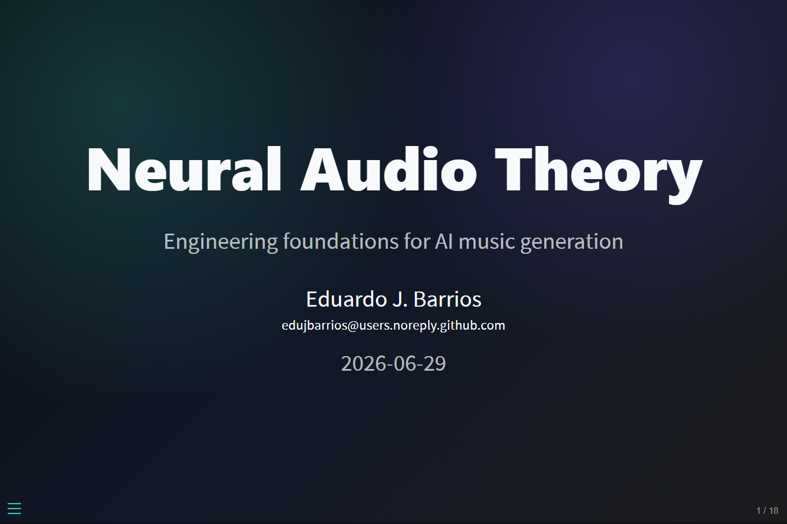

# edujbarrios Quarto Revealjs Theme

[](LICENSE)
[](https://quarto.org/)

An open-source Quarto presentation theme based on the visual branding of
[edujbarrios.com](https://edujbarrios.com/): dark charcoal surfaces, turquoise
signals, violet depth, and warm orange highlights.



## Features

- Revealjs format extension for Quarto presentations
- Dark brand palette with turquoise, violet, and orange accents
- Utility classes for cards, metric tiles, tags, section titles, and columns
- Sensible defaults for code blocks, slide numbers, transitions, and links

## Palette

The theme mirrors the current site identity:

- `#40e0d0` turquoise: primary signal and links
- `#008080` teal: light-mode accent reference from the site
- `#8b5cf6` / `#a78bfa` violet: secondary depth and gradients
- `#fb923c` orange: warm highlight
- `#0b0f14`, `#111827`, `#1b1b1d`: dark presentation surfaces

## Install

```bash
quarto add edujbarrios/edujbarrios-slide
```

## Use

```yaml
---
title: "Your Talk"
format: edujbarrios-revealjs
---
```

For local development in this repository, render the included example:

```bash
quarto render example.qmd
```

The rendered `example.html` and supporting files are generated artifacts and are
not committed to the repository.

## Slide Helpers

The theme includes a small utility vocabulary:

- `.eyebrow`: compact label above a headline
- `.brand-card`, `.compact-card`: bordered content blocks
- `.metric`, `.value`, `.label`: stat cards
- `.tag-list`, `.tag`: skill or topic chips
- `.two-column`, `.three-column`: responsive layout helpers
- `.accent`, `.violet`, `.orange`, `.muted`: brand color helpers

See `example.qmd` for a complete product-style deck based on
[`edujbarrios/neural-audio-theory`](https://github.com/edujbarrios/neural-audio-theory).

## License

MIT
